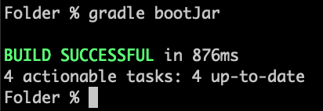
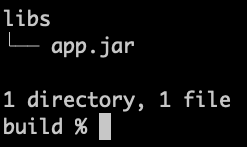
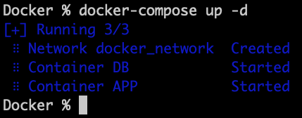
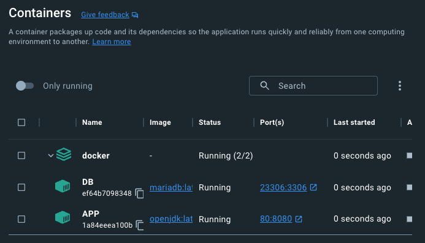
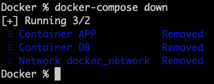

# Folder

Spring Boot + Docker

### Step 1

##### 프로젝트 배포 하기 (jar 파일 만들기)

```
./gradlew bootJar
```

</img>

### Step 2

##### build 폴더 확인 하기

```
tree build/libs
```

</img>

### Step 3

##### Docker 폴더에서 compose 실행 하기

```
docker-compose up -d
```

</img>

### Step 4

##### Docker DashBoard에서 확인 하기

</img>

### Step 5

##### Docker 컨테이너 삭제하기

```
docker-compose down
```

</img>

---

### Spring boot - Application.yml

##### > 제어 Profile

```
spring:
  profiles:
    group:
      dev:
        - dev-app
        - comm
      prod:
        - prod-app
        - comm
```

##### > 공통 Profile

```
spring:
  config:
    activate:
      on-profile: comm
  datasource:
    driver-class-name: org.mariadb.jdbc.Driver
    username: folder
    password: 1234
```

##### > 개발 Profile

```
spring:
  config:
    activate:
      on-profile: dev-app
  datasource:
    url: jdbc:mariadb://localhost:23306/edu
```

##### > 배포(운영) Profile

```
spring:
  config:
    activate:
      on-profile: prod-app
  datasource:
    url: jdbc:mariadb://DB:3306/edu
```

### YouTube Link

###### 스프링 프로젝트 [Spring URL만들기]

## [](https://youtu.be/Wbor5JdymHI)

###### 스프링 프로젝트 [Thymeleaf]

## [](https://youtu.be/2ilL4Su6ZzU)

###### 사용자 테이블 만들기 [User Table]

## [](https://youtu.be/Z_9RKMg9SYA)

###### 사용자 정보 불러오기 [User Mapper]

## [](https://youtu.be/vc7dddX2WmE)

###### 사용자 목록 이벤트 [User List]

## [](https://youtu.be/8Z08xWcI-qY)

###### 사용자 정보 이벤트 [User Detail]

## [](https://youtu.be/B3UwBuoYry8)

###### 사용자 수정 및 삭제 이벤트 [User Update or Delete]

## [](https://youtu.be/kaAxriCoV1I)

###### 사용자 추가 이벤트 [User Create]

## [](https://youtu.be/Wve-IkCz4A8)

###### 프로젝트 배포하기 [Docker Compose]

## [](https://youtu.be/oVPBRi1A-eM)
